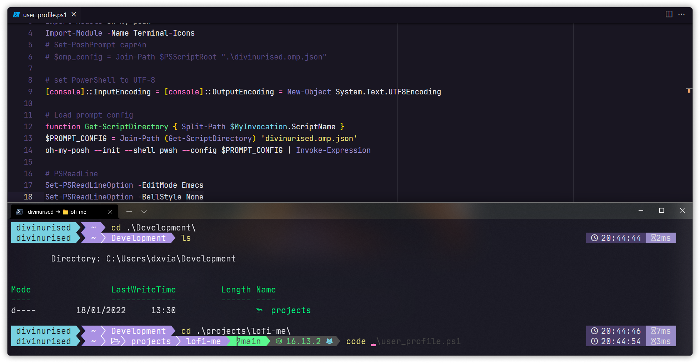

# Davi Alcântara's Dotfiles

I recently updated my Windows from 10 to 11, and I decided to change my terminal. So i recommend to use Windows 11!

## PowerShell setup

- [Scoop](https://scoop.sh/) - A command-line installer
- [Oh My Posh](https://ohmyposh.dev/) - Prompt theme engine
- [Terminal Icons](https://github.com/devblackops/Terminal-Icons) - Folder and file icons
- [PSReadLine](https://docs.microsoft.com/en-us/powershell/module/psreadline/) - Cmdlets for customizing the editing environment, used for autocompletion
- [z](https://www.powershellgallery.com/packages/z) - Directory jumper
- [PSFzf](https://github.com/kelleyma49/PSFzf) - Fuzzy finder

## Theme setup

All colors and palettes used are based on [Omni Theme](https://github.com/getomni)
